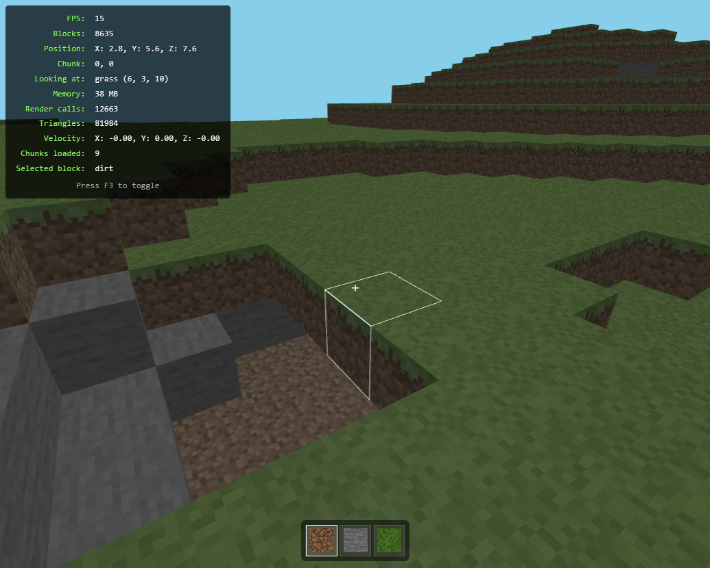
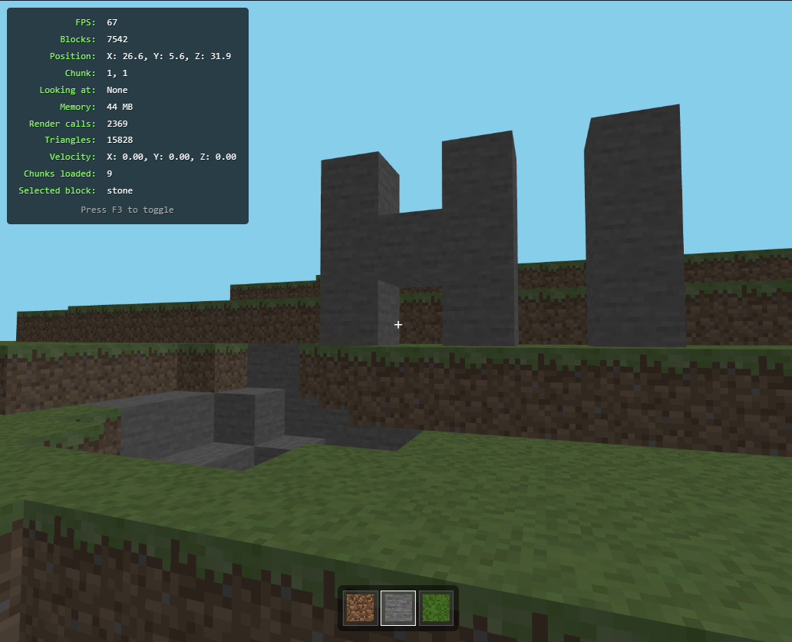

# ***PrimeCraft*** 


PrimeCraft is a Minecraft inspired minimalist voxel-based sandbox game built with Three.js, offering a simplified block-building experience in your browser.


*`Build this as an educational project for exploring threejs and thus includes AI written codes and available open resources`*

| Terrain Generation | Placed Blocks as 'HI' |
| --- | --- |
|  |  |


## 🎮 Features

- **First-Person Controls**: Smooth mouse-look and WASD movement
- **Block Interaction**: 
  - Left-click to break blocks
  - Right-click to place blocks
- **Block Types**: 
  - Dirt
  - Stone
  - Grass
- **Physics**: 
  - Gravity simulation
  - Jump mechanics
  - Collision detection
- **Dynamic World**: 
  - Procedurally generated terrain
  - Real-time block manipulation
- **Hotbar System**: Quick block selection using number keys (1-3)

## 🚀 Getting Started

### Prerequisites
- Modern web browser
- Node.js and npm installed

### Installation
1. Clone the repository:
```bash
git clone https://github.com/rhishavhere/Prime-Craft.git
cd Prime-Craft
```

2. Install dependencies:
```bash
npm install
```

3. Run the development server:
```bash
npm run start
```

4. Open your browser and navigate to `http://localhost:3000`

## 🎯 Controls

- **W/A/S/D** or **Arrow Keys**: Movement
- **Space**: Jump
- **Left Click**: Break blocks
- **Right Click**: Place blocks
- **1-3 Keys**: Select block type
- **Mouse**: Look around
- **Escape**: Release mouse cursor

## 🛠️ Built With

- [Three.js](https://threejs.org/) - 3D Graphics Library
- [PointerLock Controls](https://threejs.org/docs/#examples/en/controls/PointerLockControls) - First-person camera controls


## 👏 Acknowledgments

- Inspired by Minecraft
- Built as an educational project to explore 3D web graphics

---
